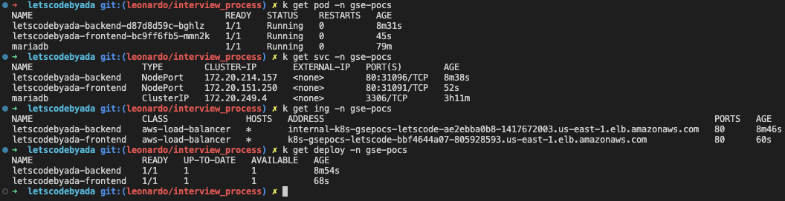
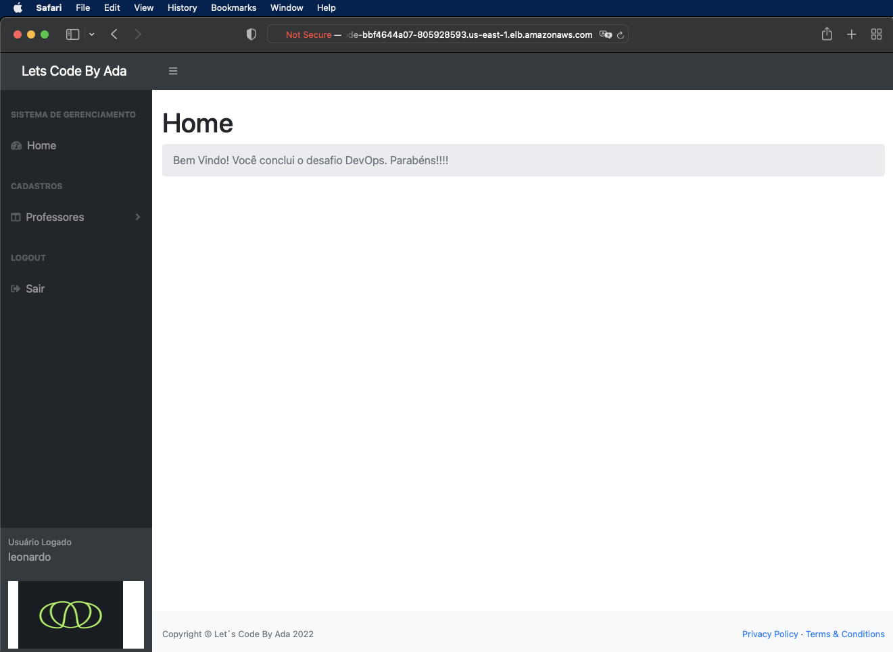

# letscodebyada
Repository used to store the infrastructure code to deploy the letscodebyada application

  
## How to create the AWS infrastructure
Follow the instructions below to create the resources in AWS.
#### Plan

    cd terraform/
    terraform init -backend-config=us-east-1/sandbox/backend.conf
    terraform plan -var-file=us-east-1/sandbox/terraform.tfvars

The commands above will initiate terraform, checking the backend and then plan the changes.

#### Apply

    terraform apply -auto-approve -var-file=us-east-1/sandbox/terraform.tfvars

  The command above will apply the changes previously shown in the plan step.

## Building the app
The *letscodebyada* application was configured to work as microservices. We currently have two components, the frontend and the backend.
First, go to the docker directory and choose the application to build:

    ├── backend
    │   └── Dockerfile
    └── frontend
        └── Dockerfile

#### Building the backend component

    docker build -t damascenolnx/letscodebyada:02-frontend .

#### Building the frontend component

    docker build --no-cache --build-arg \
    BACKEND_ENDPOINT=backend-dns.example.com \
    -t damascenolnx/letscodebyada:0.5-frontend .
**DO NOT FORGET** to update the value *backend-dns.example.com* to your ingress endpoint or DNS entry.

Then, push the image to a public repository. I decided to use Docker Hub:

    docker push damascenolnx/letscodebyada:0.5-frontend
    docker push damascenolnx/letscodebyada:0.2-backend

## Dependencies
I'm assuming you already have the EKS cluster working. If that's the case, connect to it and follow the steps below.
#### Creating a namespace

    kubectl create ns gse-pocs

#### Running MySQL/Mariadb

    kubectl run mariadb --image=mariadb --env="MARIADB_ROOT_PASSWORD=BhehxYuqlKj2g4" -n gse-pocs

#### Exposing mariadb pod
Create a service using the following YAML (Use *kubectl apply -f FILE_NAME*):

    apiVersion: v1
    kind: Service
    metadata:
      name: mariadb
      namespace: gse-pocs
    spec:
      type: ClusterIP
      selector:
        run: mariadb
      ports:
      - protocol: TCP
        port: 3306
        targetPort: 3306

#### Creating database

    kubectl exec -n gse-pocs -it mariadb -- mariadb -uroot \
    -pBhehxYuqlKj2g4 -e "CREATE DATABASE letscodebyada;"
#### Creating table

    kubectl exec -n gse-pocs -it mariadb -- mariadb -uroot -pBhehxYuqlKj2g4 -e \
    "USE letscodebyada; CREATE TABLE usuario (id INT(6) UNSIGNED AUTO_INCREMENT PRIMARY KEY,username VARCHAR(30) NOT NULL,password VARCHAR(30) NOT NULL);"
#### Adding user entry to table

    kubectl exec -n gse-pocs -it mariadb -- mariadb -uroot -pBhehxYuqlKj2g4 -e "USE letscodebyada; INSERT INTO usuario (username,password) values ('leonardo','leonardo123');"

The mariadb pod will get killed if no traffic is going to it, so make sure you run the backend app first, to create a connection.
  

## Installing apps
Assuming the EKS cluster is running and we have all the dependencies installed, follow the steps below to finally deploy the apps to our cluster.

#### Deploying the backend app

    helm install letscodebyada-backend ./helm/charts/letscodebyada-backend \
    --set mysql.user=root --set mysql.password="BhehxYuqlKj2g4" \
    --values helm/values/backend-values.yaml --namespace gse-pocs

#### Deploying the frontend app

    helm install letscodebyada-frontend \
    ./helm/charts/letscodebyada-frontend \
    --values helm/values/frontend-values.yaml \
    --namespace gse-pocs

You should be able to list all the resources:
 

## How to access the app
Check the ingress to get the ALB url:

    kubectl get ing -n gse-pocs
    NAME                     CLASS               HOSTS   ADDRESS                                                                           PORTS   AGE
    letscodebyada-backend    aws-load-balancer   *       internal-k8s-gsepocs-letscode-ae2ebba0b8-1417672003.us-east-1.elb.amazonaws.com   80      8m46s
    letscodebyada-frontend   aws-load-balancer   *       k8s-gsepocs-letscode-bbf4644a07-805928593.us-east-1.elb.amazonaws.com             80      60s

  In the example above, the frontend application would be available with the following url:
  http://k8s-gsepocs-letscode-bbf4644a07-805928593.us-east-1.elb.amazonaws.com
  
  You will be able to see the login screen:
   
  

  
  

## Notes
Here are some notes and improvements about the apps:
1. Add Docker credentials via K8S secret

2. Run MySQL on RDS

3. Build a Jenkins pipeline to run helm and store the secrets in AWS Secrets Manager or Vault

4. If the deployment requests and limites are not enough, allow the user to specify it in the values.yaml files

5. Scan repo to find vulnerabilities and remove sensitive data, such as [this](https://github.com/letscodebyada/desafio-devops/blob/main/backend/app/src/main/resources/application.yml#L22) one

6. Remove the flag --disable-host-check from the frontend image

7. Also, I would update the node application (frontend) to pass the backend endpoint via environment variables
8. Helm sensitive data should be in Helm SOPS
9. CORS needs to be properly configured. It does not work using chrome nor firefox, but it does work when Safari is used to access the application.
